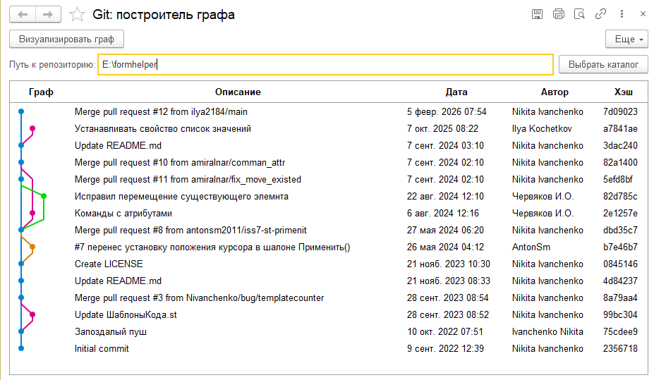

# 1С Предприятие. Работа с Git репозиторием

## Отдльное предупреждение

В этом проекте я не ставлю перед собой цель повторить все команды git. Очень сомневаюсь, что это возможно и, практически уверен, что это не нужно. Я пытаюсь выявить пользовательски паттерны работы с git и уже их переложить на API библиотеки. Если вы не увидели здесь очень нужную для вашего проекта команду git, то всегда можно создать [issue](https://github.com/zerobig/git-1c/issues) или написать самому и предложить [pull request](https://github.com/zerobig/git-1c/pulls)

## Описание

1. Расширение позволяет считывать информацию о логах git репозитория и отображать их в виде графа:

2. Реализован ряд команд git: add, commit, push, branch, checkout, ststus

## Благодарности

- [1CFilesConverter](https://github.com/arkuznetsov/1CFilesConverter)

## Лицензия

Copyright © 2026 [Бушин Илья](https://github.com/zerobig/)

Distributed under the [MIT License](https://www.mit.edu/~amini/LICENSE.md)
